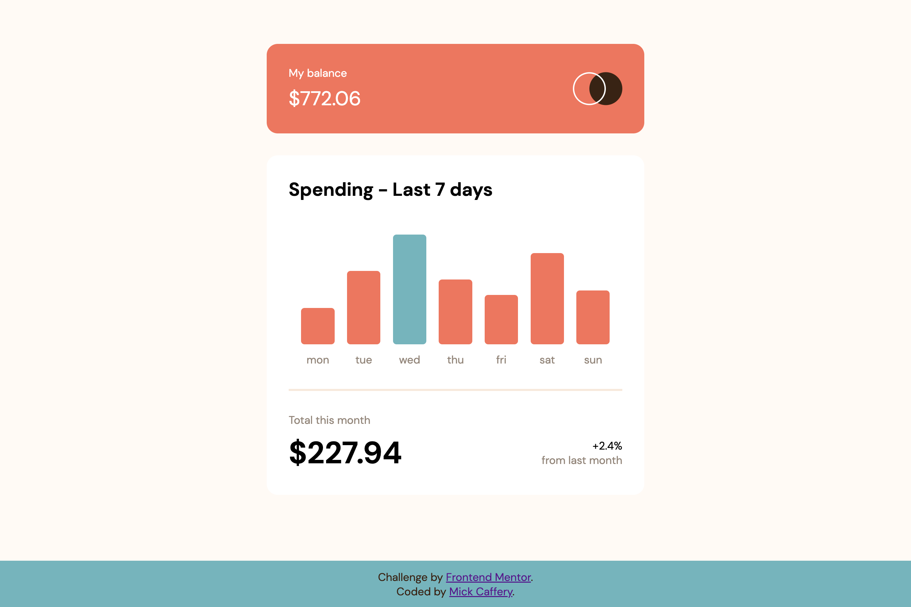
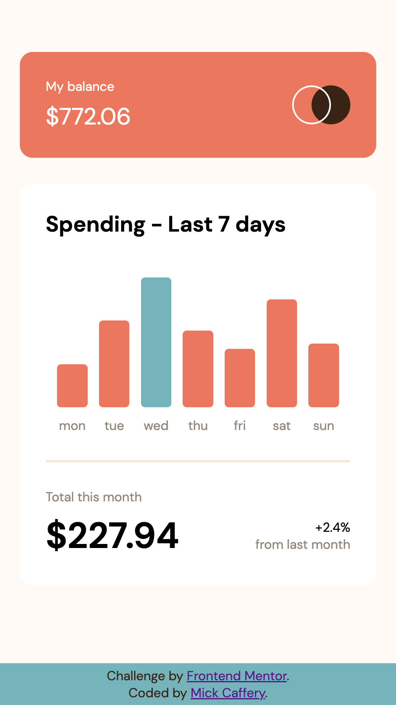

# Frontend Mentor - Expenses chart component solution

This is a solution to the [Expenses chart component challenge on Frontend Mentor](https://www.frontendmentor.io/challenges/expenses-chart-component-e7yJBUdjwt). Frontend Mentor challenges help you improve your coding skills by building realistic projects. 

## Table of contents

- [Frontend Mentor - Expenses chart component solution](#frontend-mentor---expenses-chart-component-solution)
  - [Table of contents](#table-of-contents)
  - [Overview](#overview)
    - [The challenge](#the-challenge)
    - [Screenshot](#screenshot)
    - [Links](#links)
  - [My process](#my-process)
    - [Built with](#built-with)
    - [What I learned](#what-i-learned)
    - [Continued development](#continued-development)
  - [Author](#author)
  - [Acknowledgements](#acknowledgements)

## Overview

### The challenge

Users should be able to:

- View the bar chart and hover over the individual bars to see the correct amounts for each day
- See the day with the highest expenses highlighted in a different colour from the other bars
- View the optimal layout for the content depending on their device’s screen size
- See hover states for all interactive elements on the page
- Use the JSON data file provided to dynamically size the bars on the chart

### Screenshot

Desktop View

Mobile View

### Links

- Solution URL: [https://www.frontendmentor.io/challenges/expenses-chart-component-e7yJBUdjwt](https://www.frontendmentor.io/challenges/expenses-chart-component-e7yJBUdjwt)
- Live Site URL: [https://bespoke-liger-5ec054.netlify.app/](https://bespoke-liger-5ec054.netlify.app/)

## My process

### Built with

- Semantic HTML5 markup
- CSS custom properties
- Flexbox
- Mobile-first workflow
- JavaScript

### What I learned

I learnt a lot about JS and manipulating the DOM with this exercise. I chose to create a bar chart using vanilla JavaScript and CSS, without any NPM packages.

My main learnings in regards to JS were:
- Accessing JSON data from a local file using async/await & fetch.
- Clean code principles like Single Responsibility Principle (however I have a lot more to learn in this area).

I chose to dynamically update the bar height based on the percentage relative to the day with the highest expenses for the past 7 days. This was a simple way to show how the past 7 days compare with each other. A more sophisticated graph may choose to display y-axis values and have more defined y-axis scales. 

### Continued development

I really enjoyed this challenge, as I hadn't fully realised the possibilities of creating bar charts with vanilla JS and CSS. 

I would like to repeat this feature on another project accessing an API, possibly financial data or an environmental metric like wave height. 

## Author

- GitHub - [Mick Caffery](https://github.com/mickcaff)
- Frontend Mentor - [@mickcaff](https://www.frontendmentor.io/profile/mickcaff)
- [LinkedIn](https://www.linkedin.com/in/mcaffery/)

## Acknowledgements

- I would like to thank my instructors Pang, Simon & George at [Coder Academy](https://www.coderacademy.edu.au/) where I am currently a student, studying web development.